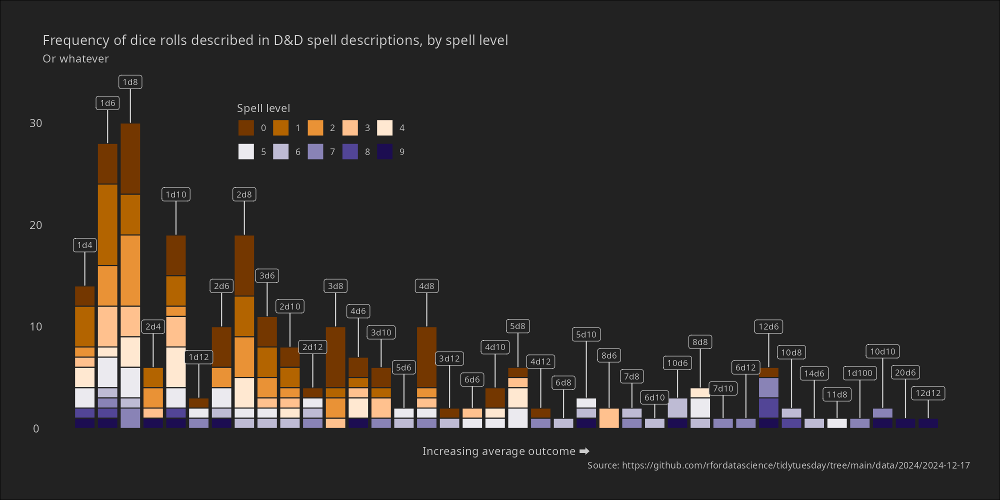
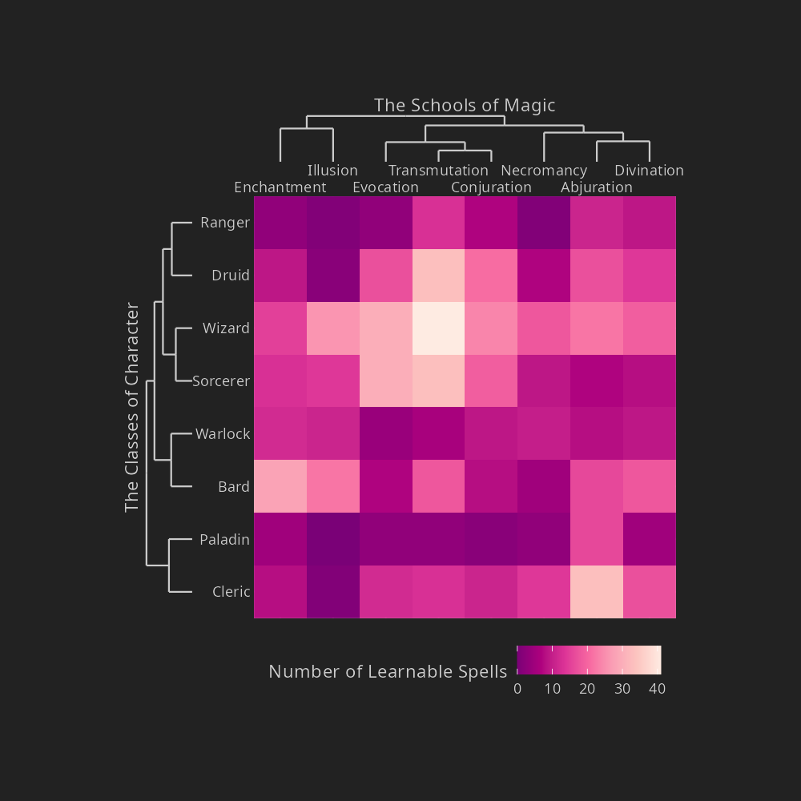

```{r, include = FALSE}
knitr::opts_chunk$set(
  collapse = TRUE,
  comment = "#>"
)

targets::tar_destroy()
```

# spells

A small TidyTuesday exercise, fun in its own right, but mostly an exercise in teaching myself how to use the targets package. 

## basic workflow

Quick look at the targets that are defined for this pipeline using `tar_manifest()`:

```{r}
library(targets)
tar_manifest()
```

Under the hood this file uses `tar_destroy()` at the beginning, in order to remove the entire `_targets` directory. We're starting from a completely fresh state, so when I call `tar_outdated()` it shows that everything is outdated:

```{r}
tar_outdated()
```

Our build function is `tar_make()`, so here goes:

```{r}
tar_make()
```

Having run everything, we check status again:

```{r}
tar_outdated()
```

Nothing is outdated, so when we call `tar_make()` nothing happens:

```{r}
tar_make()
```

## user tools   

Targets executes R code within an isolated R process (using callr), so none of the objects appear in the parent workspace when `tar_make()` is called. That's a good thing, insofar as it makes it easier to manage state in your pipelines. But it also makes it a little trickier to debug or tinker. To that end there are some user-facing tools that let you pull the tracked objects into your workspace. There's two versions. The `tar_load()` function imports the object with its original name:

```{r}
tar_load("dice_dat")
dice_dat
```

As an alternative, `tar_read()` allows you to assign the object to whatever variable name you like:

```{r}
dd <- tar_read("dice_dat")
dd
```

## the actual images

As an aside, here's the outputs:

```{r}


```


